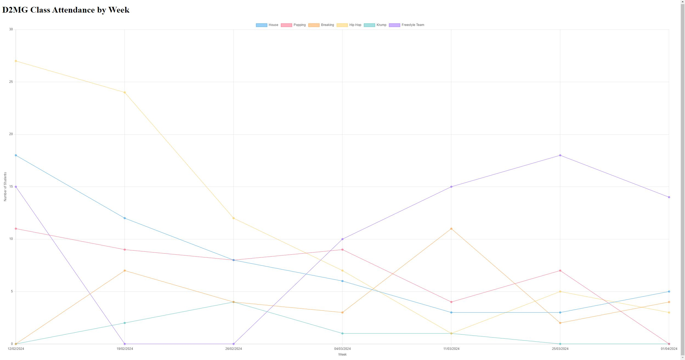

# **D2MG Dance Class Attendance Tracker Web Application**

## Description

This project is an Express.js application designed to visualize dance class attendance data. 
It serves an HTML file that displays a dynamic graph of weekly attendance for various classes, leveraging Chart.js for the visualizations. 
The attendance data is fetched in real-time from a Google Sheets document using the Google Sheets API.


## Installation

Step 1 Clone the repository:

```git clone https://github.com/Benicc/d2Insights.git```

Step 2 Install Express and GoogleAPIs:

```npm install express```

```npm install googleapis```

Step 3 Set up Google Sheets API

- Go to the Google Cloud Console.
- Create a new project (if you don't have one).
- Enable the Google Sheets API.
- Create service account credentials and download the JSON file.
- Place the JSON file in the root directory of the project and rename it to 'credentials.json'.

Step 4 Create a Google Sheet and add Attendance Data. Add the attendance data in the following format (where each record is a single person attending the class).

**Note: Make sure that the first row is empty.**


Example Data:
| Column 1 | Column 2 |
|----------|----------|
|     --     |     --    |
|2/14/2024 15:04:17 |House|
|2/14/2024 15:33:17 |House|
|2/14/2024 16:59:35 |Hip Hop|
|2/14/2024 17:05:16 |Hip Hop|
|2/14/2024 20:26:58	 |Freestyle Team|
|2/14/2024 20:27:00	 |Freestyle Team|
|2/14/2024 20:27:25	 |Freestyle Team|
|2/15/2024 19:12:29	 |Popping|
|2/15/2024 19:12:33	|Popping|
|2/20/2024 15:57:12	|Krump|
|2/20/2024 16:07:52	|Krump|
|3/6/2024 17:04:03	|Hip Hop|
|3/6/2024 17:07:35	|Hip Hop|
|3/6/2024 20:55:15	|Hip Hop|
|3/7/2024 17:59:39	|Popping|
|3/7/2024 18:02:53	|Popping|

Step 5 Replace variable spreadsheetId in line 52 in server.js to respective spreadsheet id of your google sheet.
You can find the spreadsheetId of your google sheet in the url of the sheet. For example 
for the link https://docs.google.com/spreadsheets/d/1rbyNBeNzD9D4RJ0r0Ojpo0QlRLaudQ8t3c6CjuNKaMo/edit#gid=0

the spread sheet id would be "1rbyNBeNzD9D4RJ0r0Ojpo0QlRLaudQ8t3c6CjuNKaMo".

## Usage

Step 1 Start the server:

```node src/server.js```

Step 2 Open your browser and navigate to:

http://localhost:8080

### What it should look like
With the given data in the following google sheet: https://docs.google.com/spreadsheets/d/1rbyNBeNzD9D4RJ0r0Ojpo0QlRLaudQ8t3c6CjuNKaMo/edit#gid=0

It should look something like this:




## Notes
You can change the port number/ip.
Additionally you have a google form that writes into the google sheet every time a student logs their attendance. 
This will update the graph on the web application, allowing dynamic and live attendance data to be captured and displayed.


